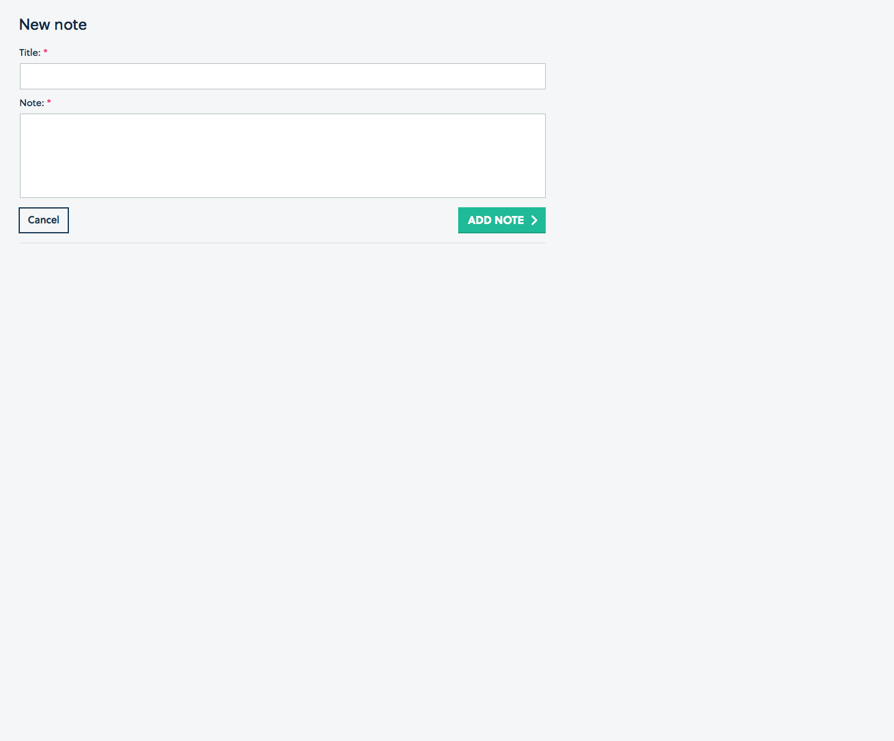
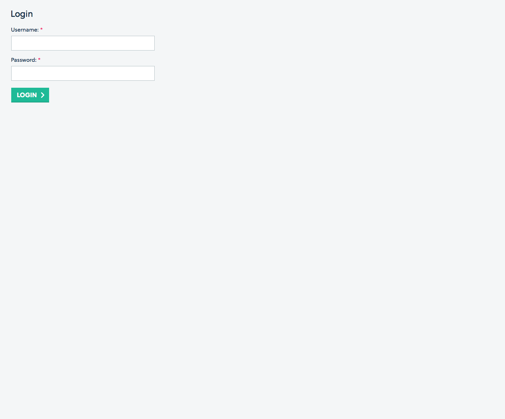
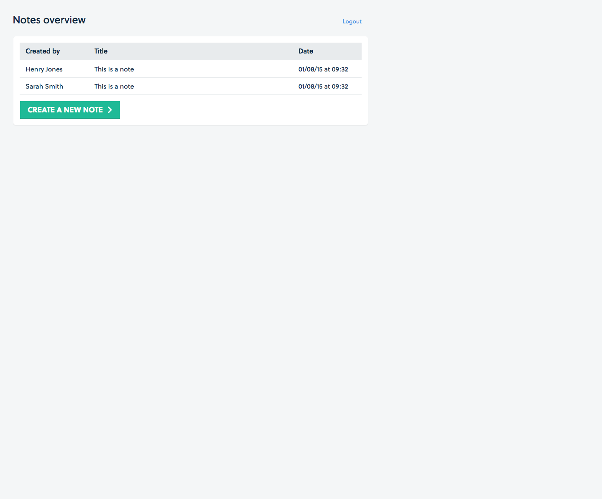
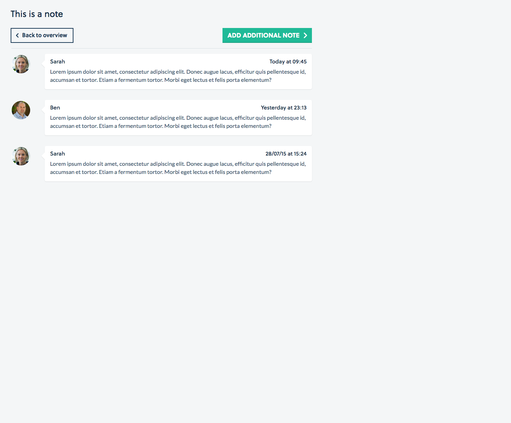
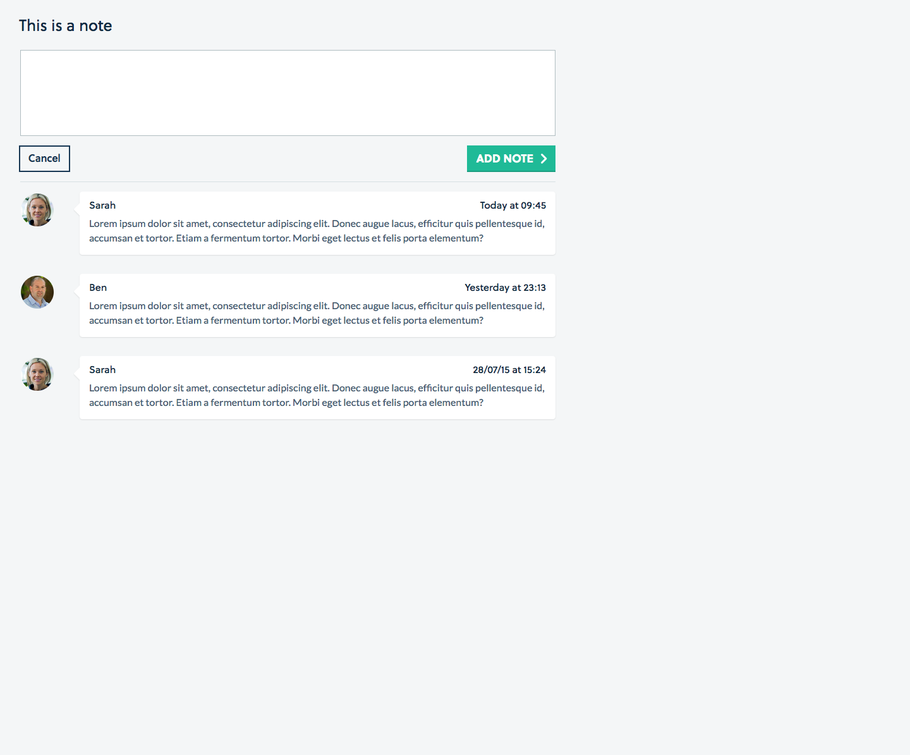

# Requirements

1. Follow the designs
2. Make a responsive app
3. Make use one or combination of: Laravel and other JS framework
4. Data needs to be stored somewhere (browser or DB) it's up to him

## Notes

This project was generated with [Angular CLI](https://github.com/angular/angular-cli) version 1.5.4.

## Hapi server

Run `npm start` for a hapi server. This will also build the project. Navigate to `http://localhost:3000/`. The app will automatically reload if you change any of the source files.

## Development server

Run `ng serve` for a dev server. Navigate to `http://localhost:4200/`. The app will automatically reload if you change any of the source files.

## Build

Run `ng build` to build the project. The build artifacts will be stored in the `dist/` directory. Use the `-prod` flag for a production build.

## Running unit tests

Run `ng test` or `npm test` to execute the unit tests via [Karma](https://karma-runner.github.io).
All 19 spec tests should pass with flying colours.

## Running end-to-end tests

Run `ng e2e` to execute the end-to-end tests via [Protractor](http://www.protractortest.org/).

## Thoughts

UX-wise I naturally thought clicking on 1 note from the overview would lead to reading 1 note. So Notes-read.png confused me with the title "This is a note", however displaying several different notes (excluding Henry's). Should the title be, "This is a Notebook" (like Evernote)? Then adding additional notes makes sense, if the overview is actually displaying Notebooks.

For an MVP, I went for the overview displaying all notes, so clicking any of them shows all notes, where one can add a note.

I noted no mockup image for CRUD on a user, so stored them locally in a service:

- Username: sarah, Password: sarah123
- Username: ben, Password: ben123
- Username: henry, Password: henry123

If had more time and depending on requirements:

- Additional components to CRUD a user
- An API to store the users, with either Express/Hapi/Koa, either caching in memory, writing to disk or in a database (e.g. Firebase), with unit testing with Mocha/Chai/Sinon, then fetch user notes from the API with HttpClientModule .get and subscribe to the result - an rxjs Observable
- Or store in browser Cookie/Session Storage/Local Storage depending on requirements
- Authenticate with server by sending tokens and refreshing expired tokens, or with JWTs, or Auth0 Lock, or Firebase User Auth
- Split the note.service into: user.service and note.service
- Notebooks which contain notes
- Error message on password failure
- Write a date pipe to also display "at" and "Today" and "Yesterday"
- Add speech bubble styling to the note cards
- Logout
- Pagination for multiple notes
- Searching notes by title and/or content and write a filter pipe
